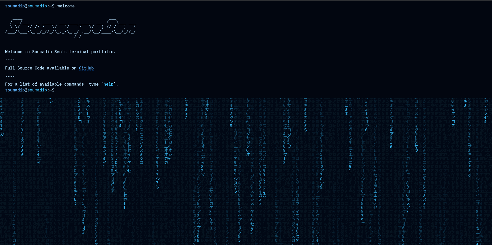

# 💻 Terminal Portfolio Website

<div align="center">



**An interactive Linux terminal-inspired portfolio built with React, TypeScript, and Vite.**

[](https://react.dev/)
[](https://www.typescriptlang.org/)
[](https://vitejs.dev/)
[](https://styled-components.com/)
[](https://www.netlify.com/)

🌐 **Live Demo:** https://soumadip-eagle123-terminal.netlify.app

</div>

---

## 🚀 About

This project is my personal portfolio presented through a fully interactive terminal interface.

Visitors can navigate the portfolio using Linux-style commands to explore my background, education, projects, social profiles, and more.

The website is built with modern frontend technologies while maintaining the feel of a real command-line environment.

---

## ✨ Features

- 💻 Interactive terminal interface
- 🎨 Multiple terminal themes
- 🌌 **Blue Matrix** theme enabled by default
- ⚡ Command autocomplete (`Tab` / `Ctrl + I`)
- 📜 Command history navigation (`↑` / `↓`)
- 🧹 Clear terminal (`Ctrl + L`)
- 📱 Responsive design
- 📦 Progressive Web App (PWA)
- 🧪 Unit tested using Vitest & React Testing Library

---

## 🖥 Available Commands

| Command | Description |
|---------|-------------|
| `about` | About me |
| `education` | Educational background |
| `projects` | Featured projects |
| `projects go <number>` | Open a project |
| `socials` | Social profiles |
| `socials go <number>` | Open a social profile |
| `themes` | Available themes |
| `themes set <theme>` | Change theme |
| `email` | Open email client |
| `gui` | Open portfolio in browser |
| `whoami` | Display current user |
| `pwd` | Display current directory |
| `history` | Show command history |
| `clear` | Clear terminal |
| `help` | Display all commands |
| `echo` | Print text |

---

## 🛠 Tech Stack

### Frontend

- React
- TypeScript
- Vite

### Styling

- Styled Components
- Styled Normalize

### Testing

- Vitest
- React Testing Library

### Deployment

- Netlify

---

## 📂 Project Structure

```text
src/
├── components/
├── contexts/
├── hooks/
├── styles/
├── test/
├── utils/
└── main.tsx
```

---

## 🖥 Running Locally

Clone the repository

```bash
git clone https://github.com/Soumadip-Eagle123/Portfolio-Website-Soumadip.git
```

Navigate into the project

```bash
cd Portfolio-Website-Soumadip
```

Install dependencies

```bash
pnpm install
```

Run the development server

```bash
pnpm dev
```

Build for production

```bash
pnpm build
```

Preview the production build

```bash
pnpm preview
```

---

## 👨‍💻 About Me

I'm **Soumadip Sen**, a Computer Science Engineering student at **VIT Chennai** specializing in **Cyber Physical Systems**.

My primary interests include:

- Artificial Intelligence
- Agentic AI
- Machine Learning
- Full-Stack Development
- Backend Engineering
- Cybersecurity
- Distributed Systems

---

## 📫 Connect With Me

- 🌐 Portfolio: https://soumadip-eagle123-terminal.netlify.app
- 💼 LinkedIn: https://www.linkedin.com/in/soumadip-sen-b44a46300/
- 💻 GitHub: https://github.com/Soumadip-Eagle123
- 📧 Email: soumadip.sen2024@vitstudent.ac.in

---

## 🙏 Acknowledgements

This project was originally inspired by the open-source terminal portfolio created by **Sat Naing**. It has been extensively customized and rebranded with my own content, projects, styling, and functionality to serve as my personal portfolio.

---

## 📄 License

This project is available under the MIT License.